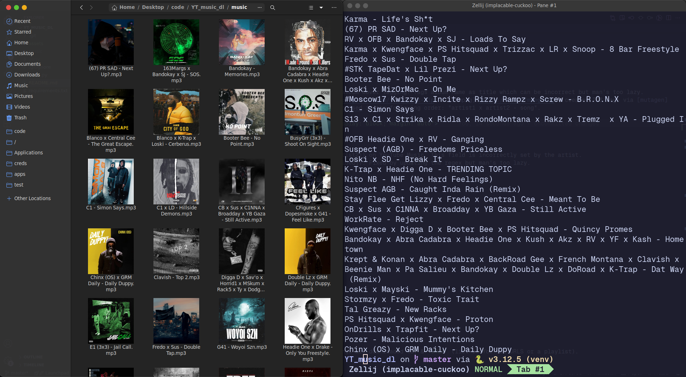

<div align="center">
   <!-- Logo -->
  <h1>YT Music Downloader</h1> <!-- Title -->
  <p>
    Download YouTube Music songs / videos with artist, title, & album cover tagging.
  </p> <!-- Description -->
  <p>
    Built With: <a href="https://github.com/yt-dlp/yt-dlp">yt-dlp</a> &bull; <a href="https://www.ffmpeg.org">FFmpeg</a> &bull; <a href="https://github.com/quodlibet/mutagen">mutagen</a>
  </p> <!-- Built With -->
</div>

---

<details>
<summary>Table of Contents</summary>

- [About](#about)
- [Getting Started](#getting-started)
  - [Installation](#installation)
- [Usage](#usage)
</details>

## About

Download YouTube Music songs / videos with artist, title, & album cover tagging. Tags album name as title which can be incorrect but man's too lazy. Downloads & creates audio (mp3) thumbnail via [yt-dlp](https://github.com/yt-dlp/yt-dlp) & [FFmpeg](https://www.ffmpeg.org), creates ID3 tags via [mutagen](https://github.com/quodlibet/mutagen). Filenames are standardised in the following order: "artist1 x artist2 - song".

<div align="center"></div>

Known limitations:

- Standardising works via regex, & regex splits artist & song name via "artist **-** song" (excluding YouTube Music songs).
- Doesn't standardise certain title names (eg artist - song [music video]). Fixed by updating the regex but man's too lazy.

prod by blvnk.

## Getting Started

### Installation

- Download FFmpeg & Python3
- Clone this repo:
  ```bash
  git clone https://github.com/adoreblvnk/YT_music_dl.git
  ```

## Usage

- [Optional] Create & activate virtual environment
  ```bash
  python3 -m venv venv && source venv/bin/activate
  ```
- Install dependencies
  ```bash
  python3 -m pip install -r requirements.txt
  ```
- In `main.py`, edit the constants `FOLDER` (folder where songs are downloaded to) & `URLS` (list of YouTube URLS or a playlist).
- Run the script
  ```bash
  python3 main.py
  ```


## Credits <!-- omit in toc -->

- [adore_blvnk](https://x.com/adore_blvnk)

<!-- Inspired by Best-README-Template (https://github.com/othneildrew/Best-README-Template) -->
<!-- Table of Contents generated by Markdown All in One (https://github.com/yzhang-gh/vscode-markdown) -->
